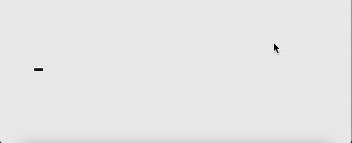
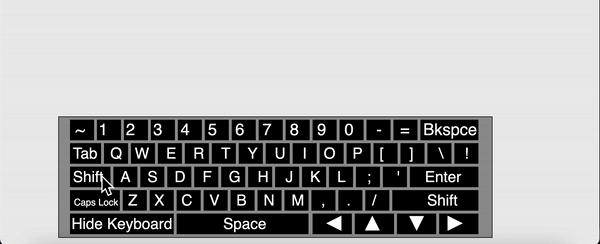
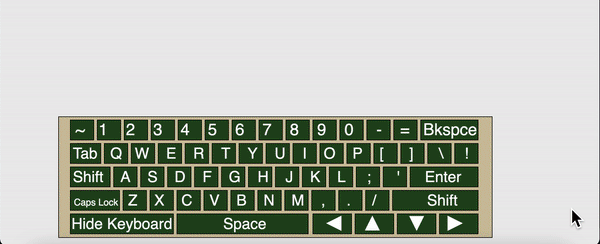
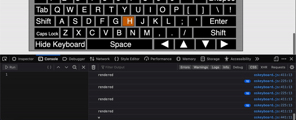

# OSkeyboard: On screen keyboard framework, implementation, and module. Use [here](https://skparab1.github.io/r/key)

## Main features:
  - fully positionable and sizable
    - takes coordinates as parameters, and repositions keyboard and keys
    - takes size as parameter and resizes all keys based on proportion and position
   
   
   
  - compatible with standard keyboard inputs
    - light up oskeyboard when keys are pressed
    - can control shift key of oskeyboard
    - can control capslock key (for turning on, i havn't figured out the off part0
    - shift and capslock implementation
      - changes characters on keyboard display

  

  - color customizable (currect webpage uses random colors on each reload)

  
  
  - optimized for fast performance
    - re-renders only when key is pressed or mouse is pressed

  

  - designed to replicate standard keyboard
    - oskeyboard is nearly identical to a regular keyboard, except for a few thoguhtful additions
  - active mouse position checker
    - actively stores mouse coordinates when clicked to avoud delay when oskey is pressed by mouse

## uses
  - For mobile
  - as a typing visualizer

## Module (doesn't work yet)
  - importing with js
  ```` '
  import {oskeyboard} from '.oskeyboard.js';
  ````
  - including as a module in HTML
  
  ````
  <script type="module" src="oskeyboard.js"></script>
  ````
  
  - usage
    - to invoke or revoke
      ````
      oskeyboard.invoke();
      ````
      ````
      oskeyboard.revoke();
      ````
    - to set color (as an array)
      ````
      oskeyboard.setcolor([200,100,0]);
      ````

    
